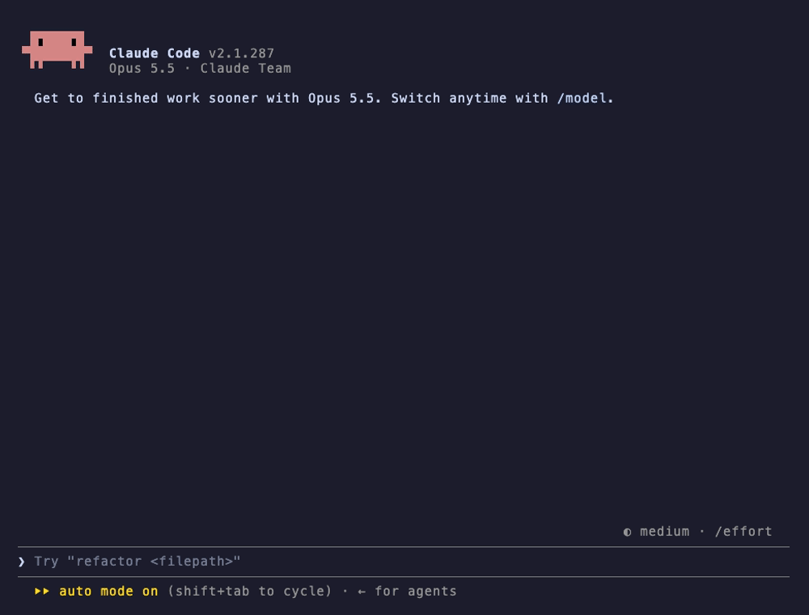
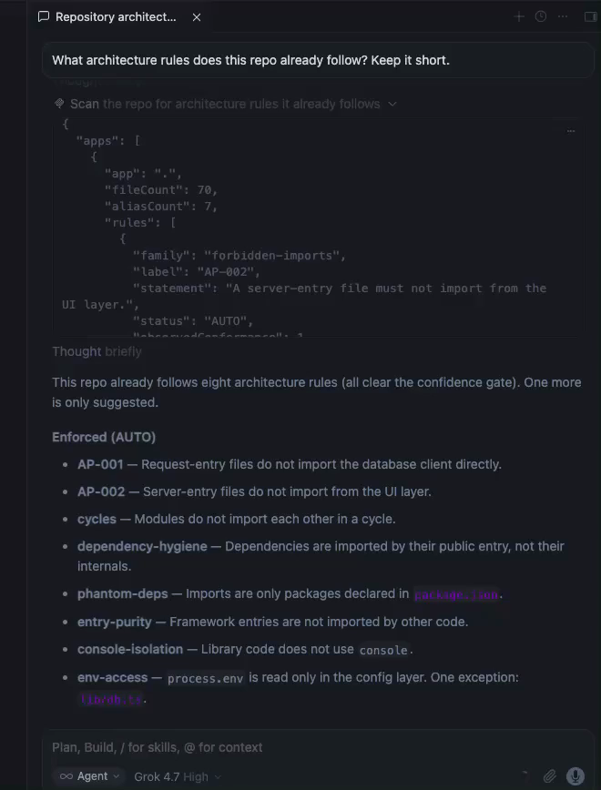
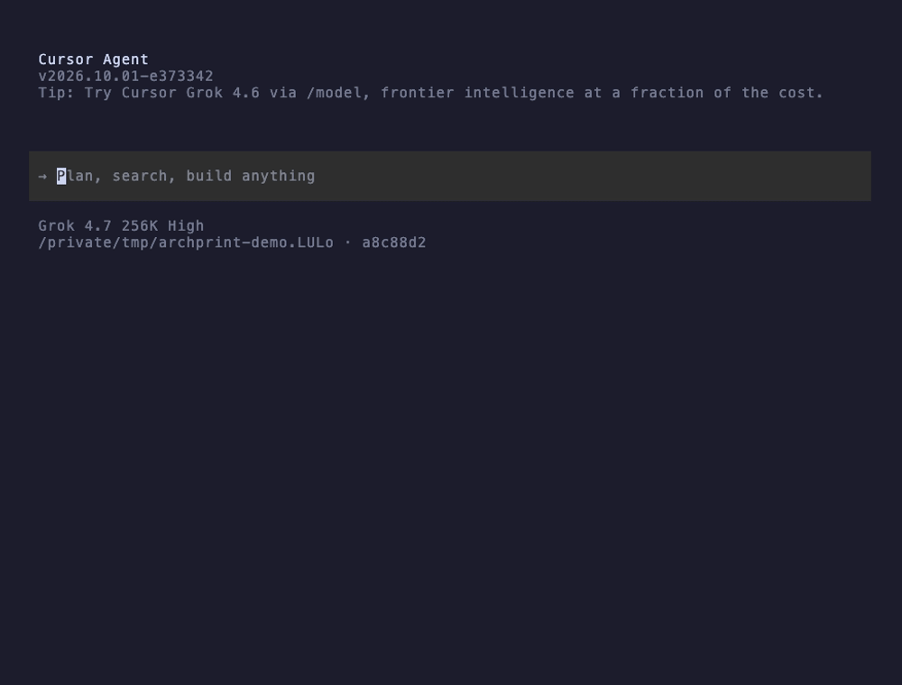

# Archprint

[](https://www.npmjs.com/package/archprint)
[](https://github.com/Tommkruix/archprint/actions/workflows/ci.yml)
[](https://www.npmjs.com/package/archprint)
[](./LICENSE)
[](https://tommkruix.github.io/archprint/)
[](https://glama.ai/mcp/servers/Tommkruix/archprint)
[](https://mcpservers.org/servers/tommkruix/archprint)

**Mine the architecture rules your repo already enforces, with the evidence attached.**

**[Try it in your browser](https://stackblitz.com/github/Tommkruix/archprint-demo)**, nothing to install ·
[Quick start](#quick-start) · [Use in CI](#use-in-ci) · [Use with AI agents](#use-it-with-ai-coding-agents) · [Docs](https://tommkruix.github.io/archprint/)

## What it does, in plain words

Every codebase has unwritten rules. "Pages never talk to the database directly." "Shared code never reaches back
into the app." Nobody wrote them down, but the code follows them, until one day someone (or an AI assistant)
breaks one without noticing.

Archprint reads a TypeScript project, finds the rules its code already follows, and shows you the proof for each
one: how many files follow it, which files break it, and how sure it is. The rules you trust become automatic
checks in the tools your team already runs, so a break is caught the next time lint runs (in your editor, a
pre-commit hook or CI), not weeks later in review.

Think of it as a building inspector who surveys the house first and writes down how it was actually built,
instead of handing you a rulebook from somewhere else.

- **For developers and tech leads:** inferred, evidence-backed lint rules for ESLint and dependency-cruiser,
  generated with `init`, connected with `wire`, and removed with `eject`.
- **For reviewers:** `archprint check` flags only the rule breaks a pull request introduces, inline on GitHub,
  never the existing backlog.
- **For teams using AI coding agents:** Claude Code, Cursor and other agents can ask Archprint for the project's
  rules, with the evidence, before they write code.
- **For anyone evaluating a codebase:** a quick, honest picture of how a project is actually structured.

Your `CLAUDE.md` is guidance. Your lint rules are enforcement. Archprint closes the gap by generating the
enforcement from patterns your codebase already demonstrates, so you adopt rules you can trust instead of
authoring them by hand.

## See it in action

The recordings below use [archprint-demo](https://github.com/Tommkruix/archprint-demo), a small Next.js API whose
routes reach the database only through a service layer.

**1. Find the rules your code already follows.** Each rule comes with its evidence.


**2. See why one rule is trusted.** The confidence check, step by step.


**3. Turn the rules on, watch a break get caught, and remove it all again.** Archprint writes its files, adds one
line to your ESLint config, lint flags a route that imports the database directly, and `eject` restores your
project exactly.


**Try it yourself, nothing to install:** [open the demo in StackBlitz](https://stackblitz.com/github/Tommkruix/archprint-demo).
The scan runs as soon as it opens, and the [demo's README](https://github.com/Tommkruix/archprint-demo#try-it)
walks through enforcing a rule in ESLint, breaking it, and asking for the rules over MCP.

## Use it with AI coding agents

AI coding agents can ask Archprint for a project's rules through
[MCP](https://modelcontextprotocol.io), an open standard that lets agents use outside tools. You ask in plain
words; the agent calls Archprint on its own and answers with the evidence. Archprint only reports. Enforcement
still runs in your linter.

**Claude Code** lists the rules with what is enforced and what is held for review, then adds a route and checks
its own change with archprint before it reports back:



**Cursor works the same way.** In these recordings Cursor was set to Grok 4.7, not Claude. In the desktop app's
chat, its agent called Archprint's scan tool on its own; this screenshot shows the tool result and the answer:



In the terminal (`cursor-agent`), it does the same: lists the rules, then adds the route and checks it with
`archprint_check`:



### Measured: the same question with and without Archprint

We asked Claude Code (Opus 5.5) "What architecture rules does this repo already follow?" on the demo app (70
files), five runs each way. Median [range]:

|                   | Without Archprint         | With Archprint            |
| ----------------- | ------------------------- | ------------------------- |
| Tokens read       | 81k [58k to 96k]          | 52k [52k to 52k]          |
| Tokens written    | 1.1k [1.1k to 1.4k]       | 0.6k [0.6k to 0.6k]       |
| Cost per question | $0.083 [$0.078 to $0.153] | $0.037 [$0.032 to $0.076] |
| Time              | 17 s [15 to 19]           | 10 s [9 to 31]            |
| Tool calls        | 5 [4 to 10]               | 2 [2 to 2]                |

What the answers showed:

- Both found the main rule: routes reach the database only through `lib/services/`.
- With Archprint, every run gave the evidence for each rule and named the one file that breaks one (`lib/db.ts`
  reads `process.env` outside the config layer). No run without it noticed that.
- Without Archprint, Claude also described naming conventions Archprint does not check.

Read these numbers with care: about 50k of the tokens read in both columns are Claude Code's own system prompt,
and this is one small repo; larger ones are not measured yet.
[Method, harness and every answer](https://github.com/Tommkruix/archprint-demo/tree/main/bench).

Setup for Claude Desktop, Claude Code, Cursor and other clients is in [MCP setup](#mcp-setup).

## Quick start

Requires Node 20 or newer. Run these in a folder with a `tsconfig.json`. In a monorepo, `scan` and `recommend`
also accept the root and cover every app, while `init` and `generate` work on one app at a time (for example
`apps/web`); at a root with several apps they stop, list the apps, and ask you to rerun with one.

```bash
# 1. See the rules your code already follows, with the evidence. Changes nothing.
npx archprint scan .

# 2. Ask why one rule is trusted (use a rule label from the scan)
npx archprint explain AP-001 .

# 3. Set up enforcement for the rules your code already follows cleanly,
#    and record what to review or adopt next in .archprint/config.json
npx archprint init .

# 4. Connect the generated rules to your ESLint / dependency-cruiser config (one managed line)
npx archprint wire

# 5. Run your linter as usual. Your code passes today; a new import that breaks a rule fails.
npx eslint .

# To undo everything, exactly:
npx archprint eject
```

**See it catch something.** After step 4, break a rule on purpose: for example, make a route file import your
database client directly, then run your linter. That is the whole loop the
[demo](https://stackblitz.com/github/Tommkruix/archprint-demo) walks through in the browser.

To keep it in the project instead of using `npx`: `npm install --save-dev archprint`.

More commands for a deliberate, step-by-step setup:

```bash
# Inspect the evidence behind one rule
archprint explain AP-002 apps/web

# Write the auto-trusted (mechanical) rules to .archprint/, only for the linters your repo uses.
# Structural-inference rules are held for review; add --include-structural to emit them too.
archprint generate apps/web

# Confirm the generated rules pass on your repo before wiring
archprint generate apps/web --check

# Generate a single rule by id after reviewing it (including a SUGGEST rule)
archprint generate apps/web --rule AP-001

# Recommend a rule set from the evidence and the detected stack (fresh repos too)
archprint recommend apps/web

# Upgrading from 0.5.x? Move an older archprint-rules/ setup to the .archprint layout
archprint migrate
```

Or build from source:

```bash
git clone https://github.com/Tommkruix/archprint
cd archprint
npm ci
npm run build
node dist/cli.js scan <path-to-your-app>
```

## How it decides what to trust

Archprint is deliberately cautious: one wrong rule hurts more than no rule. Every candidate rule passes two checks
before it is turned on for you.

**1. Is there enough evidence?** Seeing 5 of 5 files follow a pattern is not proof; 40 of 40 is. Archprint scores
each rule with a **Wilson score lower bound**, a standard statistical measure that combines how often the rule
holds with how many files it was checked on. Each rule lands in one of three groups:

- **AUTO** (enforceable): the 95% lower bound on conformance is at least 90%, with at most 3 exceptions and a
  confidently classified role.
- **SUGGEST** (provisional): the pattern holds in at least 80% of files and the role is at least 50% certain,
  but one AUTO condition fails: the confidence floor is under 90% (too few files, or too many that break it),
  more than 3 files break it, or the role is under 80% certain. Surfaced for review, not auto-generated.
- **REJECT**: not enough signal.

**2. Could the rule itself be wrong?** A rule can pass the numbers and still be wrong if Archprint guessed a
folder's purpose incorrectly. So only the **mechanical** families, which rest on unambiguous signals, are trusted
without review: forbidden imports (AP-001, AP-002), circular dependencies, test isolation, import style, console
isolation, and public-API barrels. An adversarial correctness audit (three rounds over four real repositories)
found zero false positives in these every round. All of them except circular dependencies are written as lint
rules; for cycles, Archprint reports the result but does not write a rule yet.

The **structural** families infer a "layer" or "role" from paths, which can be wrong (layer and role boundaries,
UI/data separation, entry purity, server/client, feature-slice and app isolation, env access, workspace package
API, stories isolation). Dependency hygiene, whose enforcement can over-flag, and dependency declaration are held
back too. All of these are held for your review by default and written as enforcement only with
`--include-structural`, regardless of their statistical score, until they earn the same clean record. Nothing
that could be wrong is enforced without you opting in.

Generated rules are green by construction: each one lets through the few known exception files it was inferred
from, so adopting it keeps your lint green while new violations are still caught, and a self-consistency check
refuses to write a rule whose evidence does not hold together. To run the generated rules against your code before
connecting them, use `archprint generate --check`.

## What it can detect

**Ships as:** **Auto** = turned on as enforcement (mechanical families). **Review** = held for your review by
default; emit with `--include-structural`. **Report** = shown only, never enforced.

Archprint recognizes the stack (Next.js, Nest, SvelteKit, Nuxt, Remix) and classifies UI components across React
(`.tsx`), Angular (`.component.ts`, `.directive.ts`), and Vue and Svelte single-file components (it reads the
`<script>` block of `.vue`/`.svelte` files), so the component-aware rules apply regardless of framework.

| Detector                           | Rule it can infer                                                                                                          | Ships as |
| ---------------------------------- | -------------------------------------------------------------------------------------------------------------------------- | -------- |
| Forbidden imports (AP-001, AP-002) | AP-001: a request entry (route handler) must not import the DB client. AP-002: a server entry must not import the UI layer | Auto     |
| Circular dependencies              | The module graph should stay acyclic (gated on how cycle free it already is); reported, no lint rule written yet           | Report   |
| Test isolation                     | Production (non-test) code must not import test or spec files                                                              | Auto     |
| Dependency hygiene                 | Import third-party packages by their public entry, not a dependency's `src`/`internal` internals                           | Review   |
| Dependency declaration             | Every imported third-party package must be declared in `package.json` (no phantom/transitive deps)                         | Review   |
| Import style                       | Prefer workspace aliases over deep relative imports (`../../../`)                                                          | Auto     |
| Console isolation                  | Library (non-CLI) code must not call `console.*`                                                                           | Auto     |
| Public API (barrel) boundaries     | Files outside a feature or package must import it through its `index` barrel, not deep import its internals                | Auto     |
| Layer boundaries                   | Files in one layer must not import another, inferred from the dominant dependency direction                                | Review   |
| Role layering                      | Semantic tiers keep their direction (a REPOSITORY must not import a SERVICE, a SERVICE must not import a CONTROLLER)       | Review   |
| Entry purity                       | Framework entries (pages, routes, layouts) must not be imported by other first-party code                                  | Review   |
| UI / data separation               | Reusable UI components must not import the DB/data layer directly                                                          | Review   |
| Server / client boundary           | A Next.js `"use client"` module must not import a `server-only` module                                                     | Review   |
| Feature-slice isolation            | Sibling slices under a `features`/`modules`/`slices`/`domains` container must not import each other                        | Review   |
| App isolation                      | Sibling apps under an `apps`/`services` container must not import each other directly                                      | Review   |
| Env access                         | Read `process.env` only in the config/env layer                                                                            | Review   |
| Workspace package API              | Import a monorepo workspace package by its name, not a deep path into its source                                           | Review   |
| Stories isolation                  | Storybook `.stories` files must not be imported by other code                                                              | Review   |
| Orphan modules                     | Files nothing imports and that are not framework entries (dead code candidates)                                            | Report   |
| Transitive reachability            | A layer boundary that a plain import rule passes but that leaks through an intermediary layer                              | Report   |

`recommend` (and `init`) sort every rule family into tiers: rules your code already follows (enforce now), rules
your code follows that Archprint reports but does not write yet (circular dependencies today), rules with thin
evidence (review and adopt), and rules that comparable repos commonly follow but yours does not yet (adopt from day
one). Each recommendation carries the share of comparable repos (your detected stack, else
overall) that already enforce that rule, mined from a census of tens of thousands of public TypeScript
repositories. So even a fresh repo, with little code to learn from, gets a stack-aware baseline backed by what the
ecosystem actually does rather than hand-picked defaults.

## What it writes to your project

`archprint generate` (and `init`) writes `.archprint/config.json` plus one file for each linter your repo already
runs that has rules to enforce. A typical ESLint project gets two files, `config.json` and `eslint.mjs`; a repo
whose dependency-cruiser rules are adopted too gets a third. archprint detects ESLint and dependency-cruiser, so
you are never left with config for a tool you do not have. `--emit <eslint|dependency-cruiser|all>` forces the
format.

- **`.archprint/config.json`** (always): the exact definition of each mechanical rule you adopted, with the
  evidence recorded at adoption and the resolution mode it was generated in (`archprint check` reads it, so a check
  never re-infers a rule), the exceptions you allowed with a reason, what is enforced, followed but only reported,
  held for review, and worth adopting, and the list of managed outputs `eject` removes.
- **`.archprint/eslint.mjs`** (when ESLint is present): one self-contained ESLint flat-config file that inlines
  every inferred ESLint rule (marker-based forbidden imports, `no-restricted-imports` import-style boundaries,
  console isolation) and needs no extra plugins: it adds rules to your existing ESLint setup, which already parses
  your TypeScript. So you can commit it, publish it, or hand it to another repo and adopt it in one line
  (`import archprint from './.archprint/eslint.mjs'`). It self-ignores `**/.archprint/**`. The forbidden-import
  rules (AP-) ship as a generated local eslint plugin inside it, so wiring the eslint config enforces them too, no
  extra install.
- **`.archprint/dependency-cruiser.json`** (when dependency-cruiser is present): one `forbidden` ruleset with the
  mechanical boundaries (public-API deep-import, test-isolation); the review-held ones (layer, role-layering,
  feature-slice, app-isolation, entry-purity, dependency-internals, phantom deps) are added only with
  `--include-structural`, after you review them.
- **A managed section in your `README.md`** summarizing what is enforced now, followed but only reported, held for
  review, and worth adopting (written by `init`, or `generate --readme`), plus a managed `.prettierignore` entry so
  the generated files stay out of your formatter.

`--expand` additionally writes the granular artifacts inside `.archprint/`: the per-family ESLint and
dependency-cruiser JSON, per-rule cards (`.md`) with passing and failing fixtures, the eslint-plugin-boundaries
element-types config, ts-arch tests, and the Mermaid and Graphviz DOT layer graph.

**Staying in sync, and leaving cleanly.** Re-running `generate` (or `init`) refreshes `.archprint/` and drops any
rule the evidence no longer supports, so the output never drifts from the code. `wire` inserts a single managed
reference into each enforcement tool your repo uses (a flat eslint config, a `.dependency-cruiser.json`), one that
survives those regenerations; for a config it cannot safely edit (a JS dependency-cruiser config, say), it prints
the exact snippet to paste. `eject` removes Archprint's files and every wired reference, restoring each config
exactly. `generate --check` runs the generated ESLint rules against your repo and reports whether they pass, so you
can confirm before wiring. Upgrading from 0.5.x? `archprint migrate` moves an older `archprint-rules/` setup to
this layout and rewires your configs in place.

## Use in CI

`archprint check` reports only the violations a change **introduces**, compared with a base branch, for the rules
your team adopted with `init` or `generate`. The existing backlog never shows up, and every finding carries its
evidence. It works in any CI, and on GitHub it shows each finding inline on the pull request
([see it on a demo pull request](https://github.com/Tommkruix/archprint-demo/pull/1)).

On GitHub, use the [archprint check Action](https://github.com/Tommkruix/archprint-action) (on the
[GitHub Marketplace](https://github.com/marketplace/actions/archprint-check)):

```yaml
# .github/workflows/archprint.yml
name: archprint
on: pull_request
permissions:
  contents: read
jobs:
  check:
    runs-on: ubuntu-latest
    steps:
      - uses: Tommkruix/archprint-action@v1
```

It checks out the pull request itself, so it needs no checkout step. The same check in plain steps, without the
Action:

```yaml
# .github/workflows/archprint.yml
name: archprint
on: pull_request
permissions:
  contents: read
jobs:
  check:
    runs-on: ubuntu-latest
    steps:
      - uses: actions/checkout@v5
        with:
          ref: ${{ github.event.pull_request.head.sha }}
          fetch-depth: 0
      - uses: actions/setup-node@v5
        with:
          node-version: 22
      - run: npm ci
      - run: npx archprint check --base ${{ github.event.pull_request.base.sha }} --format github
```

- **Warning by default.** Add `--fail-on new` (or the Action's `fail-on: new`) to fail the job on a new
  violation, then mark the job a required status check in your branch protection so a pull request that adds one
  can't merge.
- **Only adopted rules.** `check` reads the adopted rules in `.archprint/config.json`, written by `init` and
  `generate`, and checks only the mechanical rules recorded there, never structural ones. Rules adopted in the same
  pull request are listed but never counted against it.
- **A justified exception needs a reason.** When a file has a real reason to break a rule, record it:
  `npx archprint allow AP-001 app/api/health/route.ts --reason "Health check queries the database directly"`.
  It goes in the `allowed` list of `.archprint/config.json`, `check` stops counting it and lists it with its reason
  in the pull request, and the next `archprint generate` stops ESLint flagging it. An entry without a reason is
  rejected, and an entry the code no longer needs is pointed out. Rules enforced through dependency-cruiser (public
  API) are not covered on that side yet.
- **Removing rules is never silent.** If a pull request deletes `.archprint/config.json`, or the rules in it,
  that the base branch has, `check` warns and lists every rule that stops being checked. It does not
  fail the job, because dropping a rule can be a deliberate team decision. To make that decision need a reviewer,
  add a [CODEOWNERS](https://docs.github.com/en/repositories/managing-your-repositorys-settings-and-features/customizing-your-repository/about-code-owners)
  entry and turn on "Require review from Code Owners" in branch protection:

  ```text
  /.archprint/ @your-team
  /.github/workflows/ @your-team
  ```

- **Upgrading:** from 0.8.x or earlier, run `archprint generate` once to record the adopted rules. Until you do,
  `check` posts a notice that it did not run and exits 0. Setups from 0.9.0 to 0.11.x keep working as they are:
  `check` still reads their `rules.json` and `allow.json`, and the next `generate` moves both into `config.json`.
- **Other CI systems:** `--format json` gives version-keyed output, and the exit code is the contract: `0` ok, `1`
  new violations with `--fail-on new`, `2` the CI setup is wrong (for example a shallow clone without the base
  commit). Check out the full history (`fetch-depth: 0` or your CI's equivalent).
- **Safe on pull requests from forks.** It needs only read access, uses no secrets, and never runs your code.

## MCP setup

`archprint mcp` runs Archprint as an [MCP](https://modelcontextprotocol.io) server over stdio, so an agent can ask
what architecture rules your repo already follows, with the evidence, before it writes code. It exposes four
read-only tools: `archprint_scan`, `archprint_recommend`, `archprint_explain`, and `archprint_check`. Each rule
comes back stated in plain words, with its evidence, the files that break it, and whether archprint enforces it,
holds it for review, or only reports it. `archprint_explain` takes any rule label from the scan (for example
`AP-002` or `env-access`). `archprint_check` reports the adopted rules the agent's current change breaks,
uncommitted edits included, so it can fix them before it finishes. Point Claude Desktop, Claude Code, Cursor, or
any MCP client at it:

```json
{
  "mcpServers": {
    "archprint": { "command": "npx", "args": ["-y", "archprint", "mcp"] }
  }
}
```

**Things to ask your agent.** You do not name the tools; the agent picks them:

- "What architecture rules does this repo already follow?"
- "Which file breaks the env-access rule, and how should I fix it?"
- "I am adding a new API route. What rules should it follow in this codebase?"
- "Which rules should we enforce now, and which are worth adopting?"

**Your code stays on your machine.** This default is a local server: it reads your local checkout, so it is the
one to use for private code, and your source never leaves your machine, whichever git host you use.

**If the server will not start.** If the client says the server failed to start or `npx` was not found, it cannot
see your shell's `PATH`. Desktop apps opened from the Dock or Start menu do not load it, which is common when Node
comes from nvm or Homebrew. A full path to `npx` alone is not enough, because `npx` itself needs `node` on the
`PATH`. Point both at the folder that `dirname "$(which node)"` prints, for example `/opt/homebrew/bin`:

```json
{
  "mcpServers": {
    "archprint": {
      "command": "/opt/homebrew/bin/npx",
      "args": ["-y", "archprint", "mcp"],
      "env": { "PATH": "/opt/homebrew/bin:/usr/bin:/bin" }
    }
  }
}
```

Starting the editor from a terminal also works, because it then inherits your shell's `PATH`.

**One-line installs.** In Claude Code:

```bash
claude mcp add archprint -- npx -y archprint mcp
```

In Cursor, put the JSON above in `.cursor/mcp.json` in your project (or `~/.cursor/mcp.json` for every project),
then enable **archprint** under **Settings > MCP**.

**Scanning a public repo by URL.** `archprint mcp --http` runs a remote server instead. It clones the repo shallow
to a temp dir, runs the same read-only analysis, returns the result, and deletes the clone (only public
`github.com`, `gitlab.com`, and `bitbucket.org` URLs; nothing is written or kept). The tools then take a `repo` URL
(and an optional `ref`). It listens on `0.0.0.0:8848/mcp` by default (set `--host 127.0.0.1` to keep it to your
own machine, or `--port`/`$PORT` to change the port) and answers health checks at `/health` (use this one on Cloud
Run, which reserves `/healthz`) and `/healthz`. Every request clones and scans, so a server anyone can reach spends
compute on anyone's behalf: keep it behind authentication, such as Cloud Run's IAM, unless you accept that cost.

The tools are read-only (they never write to the repo); use the CLI's `generate`/`wire` to actually emit and
enforce rules.

## How it compares

Established TypeScript tools (dependency-cruiser, eslint-plugin-boundaries, Nx, Sheriff, ts-arch) all **enforce**
architecture rules you write by hand. Archprint **infers** them from the actual import graph and **gates each one
on statistical evidence** before proposing it. It then emits into those tools' formats, so it complements your
stack rather than replacing it.

Verified against each tool's documentation (TypeScript ecosystem). The two columns that matter are the ones no
other TypeScript tool fills:

| Tool                          | Enforces arch rules | Auto-infers from the import graph | Attaches statistical evidence |
| ----------------------------- | :-----------------: | :-------------------------------: | :---------------------------: |
| **Archprint**                 |         yes         |              **yes**              |            **yes**            |
| dependency-cruiser            |         yes         |                no                 |              no               |
| eslint-plugin-boundaries      |         yes         |                no                 |              no               |
| @nx/enforce-module-boundaries |         yes         |                no                 |              no               |
| Sheriff                       |         yes         |                no                 |              no               |
| ts-arch                       |         yes         |                no                 |              no               |
| madge / knip                  |    analysis only    |                no                 |              no               |

Honest caveat: in other ecosystems, [Tach](https://github.com/gauge-sh/tach) (Python) and ArchLint (Java) do
auto-infer module boundaries, so Archprint's specific niche is auto-inference **plus statistical evidence gating
in the TypeScript ecosystem**. Archprint also overlaps in detection with dependency-cruiser (cycles, orphans,
reachability) and knip (dead code); rather than compete, it writes the rules it generates in those tools' formats.

## Commands

- **`archprint init [path]`**: zero-config setup. Detects the stack, enforces the rules the code already follows,
  and writes `.archprint/` plus a managed README section. Options: `--expand`, `--include-structural`,
  `--out <dir>`, `--fast`, `--force`.
- **`archprint scan [path]`**: reports the rules the repo already follows, with evidence. Changes nothing.
  `--deep` resolves through barrels and aliases.
- **`archprint explain <id> [path]`**: shows the gate breakdown for one rule, with a codeframe per exception plus
  how to fix, when not to use it, and how to enforce it.
- **`archprint recommend [path]`**: recommends a rule set from the repo's evidence and detected stack (works on a
  fresh repo too), and names the installed tool that will enforce each rule it can write.
- **`archprint generate [path]`**: writes the auto-trusted mechanical rules to `.archprint/` for the linters your
  repo uses; structural rules are held for review. `--emit <eslint|dependency-cruiser|all>` forces the format,
  `--only <family>` and `--rules <ids>` narrow the output, `--check` runs the generated rules against your repo,
  `--readme` adds the README section, `--expand` also writes the per-family files, cards, fixtures and graph, and
  `--rule <id>` emits one reviewed rule. Also `--include-structural`, `--no-graph`, `--out <dir>`, `--fast`.
- **`archprint check [path]`**: reports the violations of your adopted rules that a change introduces, compared
  with `--base <branch or commit>`. Warning only unless `--fail-on new`. `--format text|json|github`,
  `--out <dir>`. See [Use in CI](#use-in-ci).
- **`archprint allow <rule> <file> --reason "..."`**: accepts one adopted rule being broken in one file, with a
  reason, recorded in `.archprint/config.json`. `check` stops counting it and lists it in the pull request;
  `generate` stops ESLint flagging it. `--remove` takes it back out.
- **`archprint wire`**: references the generated rules from the enforcement tools your repo uses (flat eslint
  config, `.dependency-cruiser.json`) through a managed, reversible reference. `--out <dir>`, `--dry-run`.
- **`archprint eject`**: removes Archprint's generated files, its config, the managed README section, and any
  wired references, restoring each config exactly. `--out <dir>`, `--dry-run`.
- **`archprint migrate`** (alias `upgrade`): moves an older `archprint-rules/` setup to the `.archprint/` layout
  and rewires your configs in place. `--dry-run`.
- **`archprint mcp`**: runs Archprint as an MCP server so Claude, Cursor, and other agents can call the read-only
  `scan`, `recommend`, `explain`, and `check` tools. Serves over stdio by default; `--http` runs a remote server
  that scans a public repo by URL (`scan`, `recommend`, and `explain`).

`scan --json`, `recommend --json` and `check --format json` emit stable, version-keyed JSON for scripting. Exit
codes are the contract: `0` on success, `1` on error (for `check`: new violations with `--fail-on new`), `2` for a
`check` that could not run because of the CI setup.

## Example on a real repo

A real scan of [inbox-zero](https://github.com/elie222/inbox-zero) (`apps/web` at commit `11281be`, 2,232 TypeScript
files), trimmed to the first rules of each section:

```
Scanned 2,232 TypeScript files
Workspace aliases: 18 resolved

GENERATED RULES
  AP-002  no-ui-layer-in-server-entry      confidence 97%
          A request handler must not import UI components.
          Evidence: 216 of 217 files it applies to follow it (99.5%)
          Exceptions: 1

LAYER BOUNDARIES (review before enforcing)
  utils !-> app  layer boundary   confidence 99%
          Evidence: 650/653 utils files conform (99.5%); 451 app file(s) depend on utils
          Exceptions: 3
  utils !-> components  layer boundary   confidence 99%
          Evidence: 650/653 utils files conform (99.5%); 160 components file(s) depend on utils
          Exceptions: 3
  hooks !-> app  layer boundary   confidence 94%
          Evidence: 65/65 hooks files conform (100%); 121 app file(s) depend on hooks
```

`AP-002` is a mechanical family, so it auto-generates as enforcement. The layer boundaries are inferred, so they
are shown for review, not written as enforcement unless you pass `--include-structural`. Every number is measured
from the import graph, not estimated.

## Technical notes

**Fast and deep modes.** `scan` defaults to a **fast** specifier-level pass (no type checker). `generate` defaults
to a **deep** pass that resolves through barrels and workspace aliases, since generation is the commitment point.
Structural analysis (cycles, orphans, reachability, public-API) always uses the fast graph: it is faithful to deep
resolution for those, and public-API detection in fact requires it (deep resolution would resolve through a barrel
and erase the barrel-versus-deep signal).

**Determinism.** The same repo at the same version produces the same output. Analysis is pure and sorted; there is
no randomness, and the analysis engine is pinned to an exact version.

## Status

Published on npm and safe to run on your real repo. Every rule is review-gated by default, reversible in one
command (`archprint eject`), and deterministic, and generated rules are green by construction on the code they
were inferred from.

- **Validated at scale:** the latest census (archprint 0.12.2, October 2026) ran `scan` over 92,861 public
  TypeScript repositories with no crashes; 494 (0.5%) could not be fetched or timed out, most of them deleted or very
  large repositories. The full workflow (`init`, `check`, `allow`, `generate`, `check`, `wire`, `eject`) ran on a
  2,019-repo stratified sample: it found one bug, exceptions in route folders like Next.js `[id]`, fixed in 0.12.3, and
  all 2,012 repositories it ran on came back exactly as they were after `eject`.
- **Production-ready today:** `scan` and `recommend`, `check` for pull requests, and auto-enforcement of the
  mechanical families, with a self-consistency check at generate time, an `init` scaffolder for fresh repos, and
  framework coverage across React, Angular, Vue, and Svelte. The engine (twenty detectors, the confidence gate, and
  emitters for a self-contained ESLint file, dependency-cruiser, ts-arch, and the layer graph) is in place and
  tested.
- **Still ahead:** hardening the structural families toward auto-enforcement (a real per-file role-confidence
  measure, layer cohesion, role-classifier ordering).
- **Versioning is still 0.x,** so the CLI surface and rule format can refine between minor versions. That is a
  maturing surface, not experimental analysis. The compact `.archprint/` layout arrived in 0.6.0, and
  `archprint migrate` upgrades an older setup in place.

A companion benchmark, [AgentRuleBench](https://github.com/Tommkruix/agentrulebench), measures the
guidance-vs-enforcement question directly (a pre-registered, honest null result on the boundary it tested).

## Words used here

- **Import:** a line in one file that uses code from another. Archprint's rules are about which files may import
  which.
- **Lint rule / linter:** an automatic check that runs on your code (ESLint is the most common one) and flags
  problems as you write.
- **AUTO / SUGGEST / REJECT:** how confident Archprint is in a rule; see
  [How it decides what to trust](#how-it-decides-what-to-trust).
- **Mechanical / structural families:** rules based on unambiguous signals (trusted without review) versus rules
  that depend on guessing a folder's role (held for your review).
- **MCP:** an open standard that lets AI agents use outside tools such as Archprint.

## Documentation

Full docs live at [tommkruix.github.io/archprint](https://tommkruix.github.io/archprint/) and in
[`docs/`](./docs/): [getting started](./docs/getting-started.md), [concepts](./docs/concepts.md) (the confidence
gate, mechanical vs. structural, fast vs. deep, the generate/wire/eject lifecycle), and the
[rule-family reference](./docs/rules.md) (what each rule detects, how it ships, and when not to use it).

## Contributing

See [CONTRIBUTING.md](CONTRIBUTING.md). The project lints, type checks, and tests itself; every change keeps
coverage above its thresholds and ships a changeset.

## License

[MIT](LICENSE)
